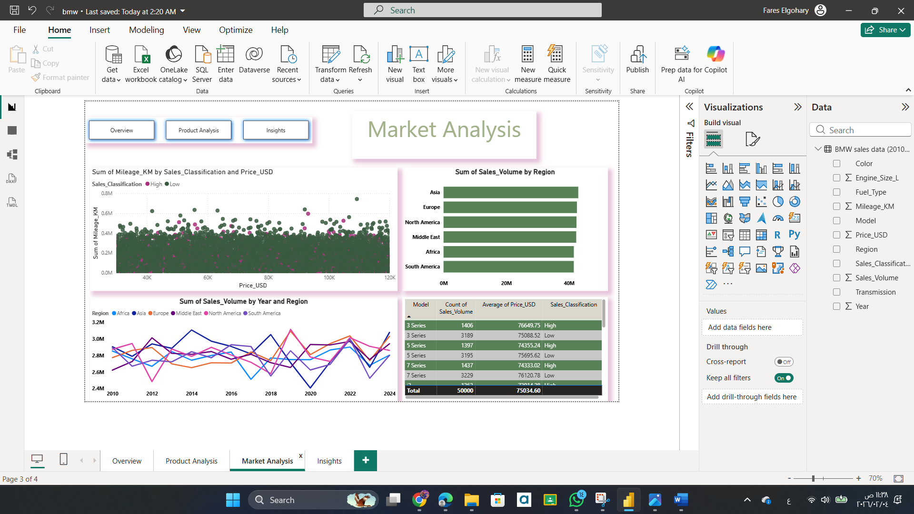
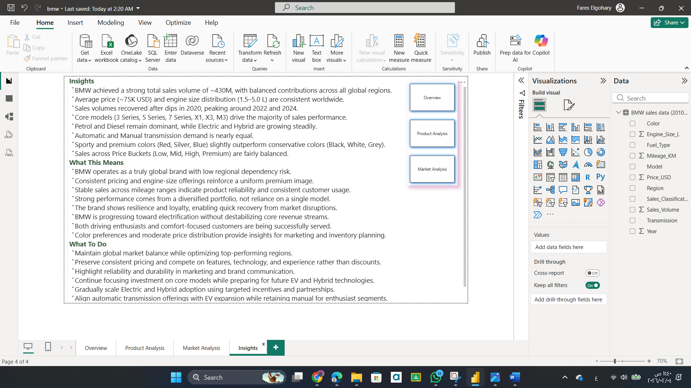

# 🏎️ BMW Sales & Market Intelligence Analysis (Power BI)

## 📌 Project Overview
This project presents a full business intelligence analysis of BMW global sales performance using interactive Power BI dashboards.

The goal was not only to visualize data, but to transform raw automotive sales data into strategic insights that support product evaluation, pricing understanding, and market decision-making.

The dashboards simulate executive-level reporting used in real automotive analytics environments.

---

## 🎯 Objectives
⭐ Analyze global BMW sales performance trends  
⭐ Identify top-performing models and engine categories  
⭐ Understand regional market demand behavior  
⭐ Evaluate pricing structure across segments  
⭐ Deliver executive-level data storytelling  

---

## 📊 Dashboard Structure

### 1️⃣ Overview Dashboard
⭐ Total Sales Volume KPI  
⭐ Average Price & Mileage KPIs  
⭐ Model Distribution  
⭐ Sales Trend Visualization  

### 2️⃣ Product Analysis
⭐ Engine Size Analysis  
⭐ Fuel Type Performance  
⭐ Color & Transmission Insights  
⭐ Model-Level Sales Comparison  

### 3️⃣ Market Analysis
⭐ Sales Volume by Region  
⭐ Price vs Mileage Relationship  
⭐ Global Yearly Sales Trends  
⭐ Sales Classification Analysis  

### 4️⃣ Insights Dashboard
⭐ Executive Summary  
⭐ Market Positioning Insights  
⭐ Product Portfolio Performance  
⭐ Strategic Recommendations  

---

## 🧠 Key Business Insights
⭐ BMW maintains balanced global sales contributions across regions.  
⭐ Core models (3 Series, 5 Series, X Series) drive the majority of performance.  
⭐ Premium pricing strategy remains consistent worldwide.  
⭐ Hybrid and Electric segments show steady growth trends.  
⭐ Sales volumes recovered strongly after 2020 market fluctuations.  

---

## 💡 Strategic Recommendations
⭐ Maintain premium positioning instead of competing on discounts.  
⭐ Expand hybrid and electric offerings gradually.  
⭐ Strengthen focus on high-performing global regions.  
⭐ Diversify product portfolio to minimize risk dependency.  

---

## 🛠 Tools Used
⭐ Power BI  
⭐ Data Modeling  
⭐ KPI Analysis  
⭐ Business Intelligence Visualization  

---

# 📊 Dashboard Preview

## 🧾 image-overview

## 🚗 image-product-analysis

## 🌍 image-market-analysis

## 🧠 image-key-insights

